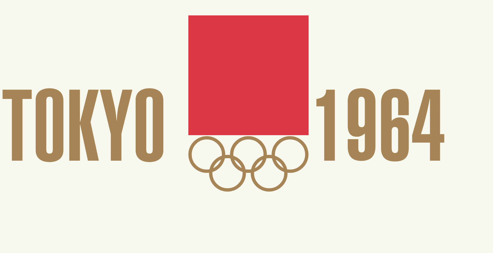
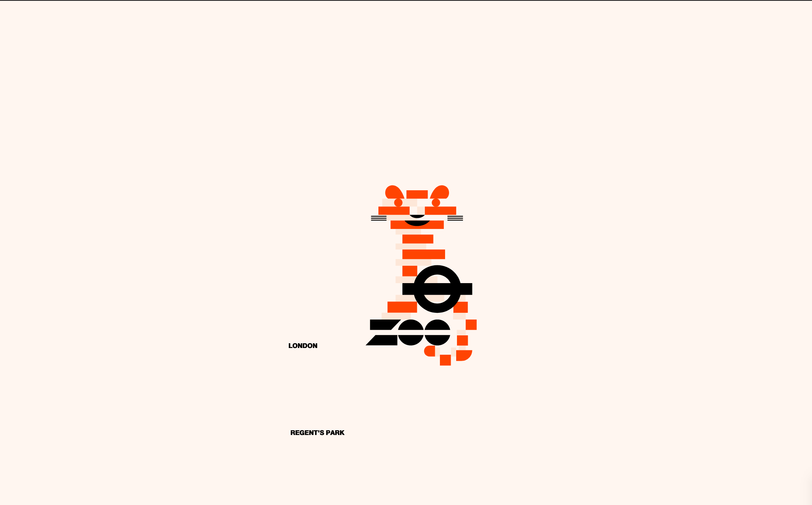
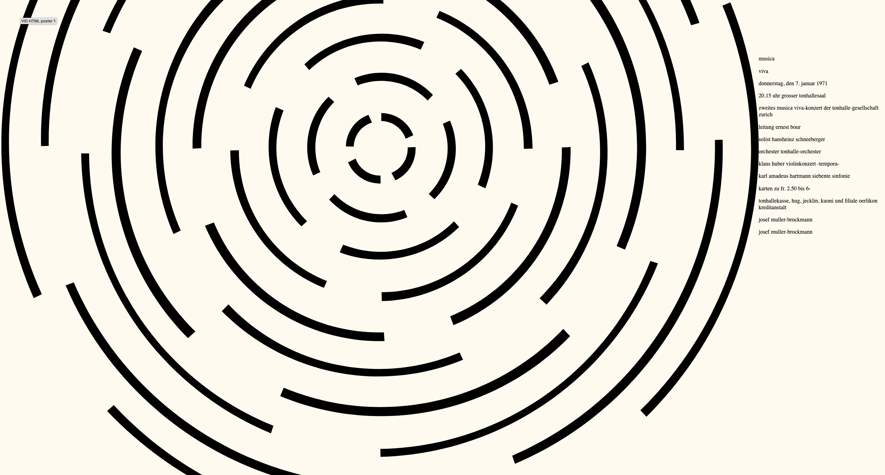
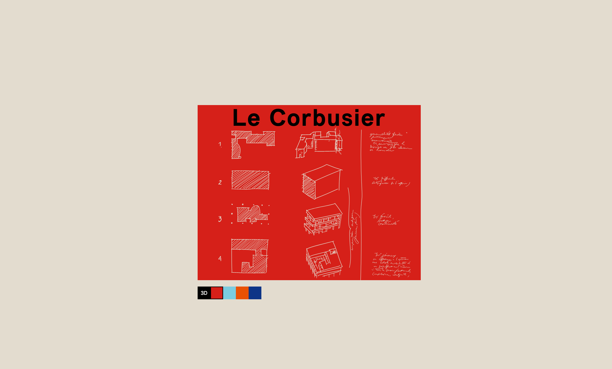
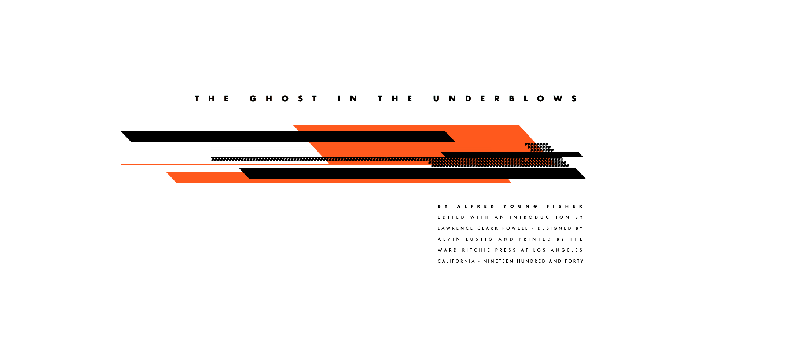
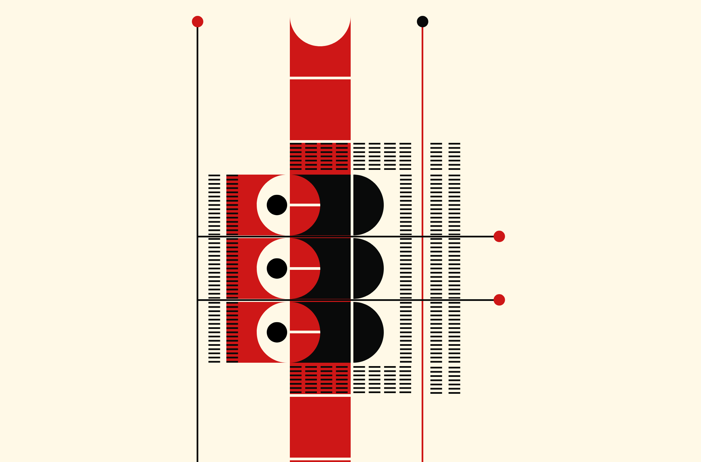

# ![Web animation - Examples][banner-examples]

## Student examples
> Here are some results from the previous years. **Note**: _The curriculum of this year might have different requirements then the examples shown below_.

### 18/19

<table>
  <tr valign="top">
    <td width="25%"><a href="https://github.com/TristanGalavazi"><strong>@TristanGalavazi</strong></a> </td>
    <td width="25%"><a href="https://github.com/Joopakerboom/"><strong>@Joopakerboom</strong></a> </td>
    <td width="25%"><a href="https://github.com/JanneJansen"><strong>@JanneJansen</strong></a> </td>
  </tr>
</table>

<table>
  <tr valign="top">
    <td width="25%"><a href="https://github.com/batuhanarican"><strong>@batuhanarican</strong></a> </td>
    <td width="25%"><a href="https://github.com/stefmike12/"><strong>@stefmike12</strong></a> </td>
    <td width="25%"><a href="https://github.com/brittrademaker"><strong>@brittrademaker</strong></a> </td>
  </tr>
</table>

[banner-examples]: https://cmda-bt.github.io/be-course-18-19/assets/banner-examples.svg
